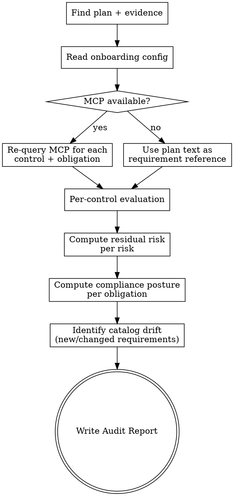

# Governance Audit

## Overview

Evidence collection asks "do we have proof of these controls?" An audit asks "given this proof, how effective are we, and what risk remains?". This skill:

1. Re-queries the Governance Hub MCP for canonical requirement details — what each control is _supposed_ to look like when fully implemented, and what each policy obligation actually demands
2. Evaluates the gathered evidence against those canonical requirements (not just against itself)
3. Computes **residual risk** per risk (the post-control risk that actually remains)
4. Computes **compliance posture** per obligation
5. Produces a structured Audit Report — the deliverable a regulator, executive, or board would want to see

The audit is grounded in three sources:

- The **governance plan** (risks, controls, obligations identified for this system)
- The **evidence register** (what's actually been gathered and how it was categorized)
- The **MCP catalog** (canonical, current definitions of each control and obligation)

## Inputs

This skill requires both a governance plan and an evidence register. **Resolve both
by `system_id`, never by "most recent file"** — the audit's residual risk and
compliance posture are wrong if the plan and evidence belong to different systems.

1. Read `./docs/credoai/registry.md`. If more than one system is registered, ask
   the user which system this audit is for; take its `system_id`.
2. **Plan**: the `./docs/credoai/aigov_plans/` file whose frontmatter `system_id`
   matches.
3. **Evidence**: the `./docs/credoai/aigov_evidence/` register whose frontmatter
   `system_id` matches the same value.

The plan and evidence MUST carry the same `system_id` — never pair across systems.

If either is missing, pause and suggest the missing prior step:

- No plan → `aigov-intake` then `aigov-plan`
- No evidence → `aigov-evidence`

Without an evidence register, the audit can't evaluate anything — refuse to proceed and explain why. Don't try to fudge by treating the plan as evidence.

## MCP requirement

This skill is materially worse without the MCP — it can still produce an audit using only the evidence and the plan's existing control text, but it loses the ability to detect:

- Catalog updates since the plan was written (new requirements added, criteria sharpened)
- Effectiveness criteria not captured in the original plan summaries
- Cross-references between obligations the plan didn't surface

If the MCP is unavailable, run the audit anyway but note the limitation in the report and recommend re-running once MCP access is restored.

## Workflow



## Step 1 — Read inputs

Read the plan, the evidence register, and onboarding config. **Local-first, global-fallback** for config:

```bash
# Resolve plan + evidence by system_id (from the registry), not "most recent"
cat ./docs/credoai/registry.md 2>/dev/null || cat ~/.claude/credoai/registry.md 2>/dev/null
grep -l "system_id: <SYSTEM_ID>" ./docs/credoai/aigov_plans/*.md 2>/dev/null | head -1
grep -l "system_id: <SYSTEM_ID>" ./docs/credoai/aigov_evidence/*.md 2>/dev/null | head -1
cat ./docs/credoai/posture.md 2>/dev/null || cat ~/.claude/credoai/posture.md 2>/dev/null
cat ./docs/credoai/tools.md 2>/dev/null || cat ~/.claude/credoai/tools.md 2>/dev/null
```

Confirm the plan and evidence register carry the **same `system_id`**. If they differ, pause and ask the user which is correct — never audit a plan against another system's evidence.

## Step 2 — Re-query MCP for canonical detail

If the MCP is connected, for every control and every policy obligation in the plan:

1. Run `governance_query` to find the catalog entry for that exact name
2. Run `get_entities` to fetch the full record (truncated descriptions distort effectiveness criteria — always pull full)
3. Capture for each control: implementation guidance, effectiveness criteria, related risks, related obligations
4. Capture for each obligation: full requirement text, source regulation citation, mandatory vs recommended, related controls

Track which catalog entries differ materially from the plan's summary text — those are candidates for the "Catalog drift" section of the report.

## Step 3 — Per-control evaluation

For each control in the plan, evaluate evidence against the canonical requirement (or plan text if MCP unavailable). Produce one of:

| Effectiveness rating             | Meaning                                                                                                                                                 |
| -------------------------------- | ------------------------------------------------------------------------------------------------------------------------------------------------------- |
| **Effective**                    | Evidence demonstrates the control is implemented at the level the requirement demands; meets criteria across sufficiency, recency, scope, verifiability |
| **Partially Effective**          | Evidence shows the control is in place but with material gaps — some criteria met, others not                                                           |
| **Ineffective**                  | Evidence is aspirational, stale, or covers too narrow a scope to support reliance                                                                       |
| **Not Implemented**              | Evidence register has this as Missing; no implementation to evaluate                                                                                    |
| **Implemented but Unverifiable** | Implementation has happened but evidence isn't independently verifiable (e.g., vendor attestation without third-party audit)                            |

The evaluation must reference:

- The canonical requirement source (catalog entry name + fetched content, or plan text)
- The specific evidence pieces from the register
- The reasoning that connects them

Apply rigor calibration the same way `aigov-evidence` does:

| Posture       | Default audit rigor                 |
| ------------- | ----------------------------------- |
| Conservative  | Strict (auditor mindset — high bar) |
| Balanced      | Standard                            |
| Speed-focused | Pragmatic (good-faith threshold)    |

Confirm or override with `AskUserQuestion`:

> "How rigorous should this audit be?
>
> 1. **Pragmatic** — internal review, accept good-faith implementations
> 2. **Standard** — peer-review level, flag substantive gaps
> 3. **Strict** — external auditor mindset; if a regulator wouldn't accept it, neither will I
>
> Based on your posture, I'd suggest **{{default}}**."

## Step 4 — Compute residual risk

For every risk in the plan, compute residual risk based on the effectiveness of its mapped controls.

**Approach** — apply judgment, not formulas:

1. Start from the initial risk score (severity × likelihood) and tier from the plan
2. Identify all controls in the plan that mitigate this risk (`mitigated_risk_count` relationships, plus the plan's mitigation mappings)
3. Look up the effectiveness rating from Step 3 for each of those controls
4. Reason about residual risk along three dimensions:

   | Dimension            | Question                                                                                                |
   | -------------------- | ------------------------------------------------------------------------------------------------------- |
   | Likelihood reduction | Do the controls (at their current effectiveness) actually reduce the chance of this risk materializing? |
   | Severity reduction   | If the risk does materialize, do the controls limit blast radius?                                       |
   | Detection            | If something does go wrong, will we know quickly?                                                       |

5. Assign a residual tier: **Critical / High / Medium / Low / Effectively Mitigated**

   _"Effectively Mitigated"_ means the residual risk is low enough that further work isn't priority — distinguished from _"Low"_ which still warrants monitoring.

6. **Floor:** A non-negotiable from posture being violated keeps residual at Critical regardless of control effectiveness — controls can't override organizational red lines.

For each risk, the report shows: initial tier, contributing controls + their effectiveness, residual tier, and a 1–2 sentence rationale.

## Step 5 — Compute compliance posture

For every obligation/policy requirement in the plan, evaluate:

| Status                  | Meaning                                                                            |
| ----------------------- | ---------------------------------------------------------------------------------- |
| **Compliant**           | Evidence demonstrates the obligation is met; controls satisfying it are Effective  |
| **Partially Compliant** | Some satisfying controls are in place but gaps remain                              |
| **Non-Compliant**       | Required controls are Not Implemented or Ineffective                               |
| **Not Applicable**      | The obligation doesn't apply to this system based on its actual deployment context |

Group obligations by source regulation in the report. Sum the per-source counts: e.g., "EU AI Act: 3 of 5 obligations Compliant, 2 Partially Compliant, 0 Non-Compliant".

Cross-reference Non-Compliant items with their associated risks — non-compliance often correlates with elevated residual risk and that linkage matters.

## Step 6 — Catalog drift

Only when MCP was used. List requirements where the canonical catalog entry has drifted from what the plan captured:

- **New requirements added** — catalog has obligations or controls not in the plan
- **Criteria sharpened** — effectiveness criteria for an existing control are stricter than the plan reflected
- **Deprecated** — something the plan referenced is no longer in the catalog

For each drift item, recommend whether it warrants re-running `aigov-plan` (significant changes) or just a note in the audit (minor refinements).

## Step 7 — Recommendations

Synthesize 3–5 prioritized actions across the audit findings. Each action ties to specific risks/obligations and suggests an owner type (engineering / compliance / procurement / leadership).

Sort by:

1. Address Non-Compliance with mandatory regulations
2. Reduce Critical/High residual risks
3. Close gaps in controls flagged Ineffective
4. Address catalog drift if material

## Step 8 — Write the Audit Report

Save to:

```
./docs/credoai/aigov_audits/YYYY-MM-DD-<system-name>.md
```

Slug: lowercase system name from the plan, spaces → hyphens, strip special chars. Create the directory if needed.

**Stamp the report's frontmatter** with the `system_id` carried from the plan and
evidence, so the registry derives the audit stage by identity:

```markdown
---
system_id: sys_<slug>_<hex>
system_name: <Name>
artifact_type: audit
date: <YYYY-MM-DD>
---
```

## Output Format

```markdown
## Governance Audit: [System/Use Case Name]

**Date:** YYYY-MM-DD
**Plan reference:** [path + date]
**Evidence reference:** [path + date]
**Audit rigor:** Pragmatic | Standard | Strict
**Posture used:** [Conservative / Balanced / Speed-focused — local | global | none]
**MCP catalog version:** [from get_catalog_overview, or "MCP unavailable"]

### Executive Summary

[3–5 sentences: overall posture, count of risks at each residual tier, count of obligations at each compliance status, biggest concern, biggest strength.]

### Residual Risk Assessment

| Risk                      | Initial tier | Contributing controls (effectiveness)                      | Residual tier | Rationale                                             |
| ------------------------- | ------------ | ---------------------------------------------------------- | ------------- | ----------------------------------------------------- |
| [Exact catalog risk name] | Critical     | [Control A] (Effective), [Control B] (Partially Effective) | High          | Controls reduce likelihood but blast radius unchanged |

Show every Critical and High initial-tier risk in full. Summarize Medium/Low.

### Compliance Posture

#### [Source regulation, e.g. EU AI Act]

- {{N}} obligations Compliant / {{M}} Partial / {{K}} Non-Compliant

| Obligation              | Status    | Satisfying controls (effectiveness) | Notes                        |
| ----------------------- | --------- | ----------------------------------- | ---------------------------- |
| [Exact obligation text] | Compliant | [Control A] (Effective)             | Covers all production models |
| ...                     | ...       | ...                                 | ...                          |

Repeat per source regulation.

### Per-Control Evaluations

#### Effective

##### [Exact catalog control name]

**Requirement:** [1–2 sentence summary of the canonical requirement from MCP, or plan text]
**Evidence:** [reference to evidence-register entry]
**Reasoning:** [why this evidence demonstrates the requirement is met at the chosen rigor level]

---

#### Partially Effective

##### [Exact catalog control name]

**Requirement:** [...]
**Evidence:** [...]
**Gap:** [specific dimension(s) — sufficiency, recency, scope, verifiability]
**To uplift to Effective:** [concrete action]

---

#### Ineffective

##### [Exact catalog control name]

**Requirement:** [...]
**Evidence:** [what was provided]
**Why ineffective:** [reasoning — typically aspirational, stale, or out of scope]
**To remediate:** [concrete action]

---

#### Not Implemented

##### [Exact catalog control name]

**Requirement:** [...]
**Status:** No evidence in register
**Risks affected:** [list]
**To implement:** [concrete first step]

---

#### Implemented but Unverifiable

##### [Exact catalog control name]

**Requirement:** [...]
**Evidence:** [what exists]
**Verification gap:** [what would make this verifiable — e.g., third-party attestation, observable logs]

---

### Catalog Drift

_(Only if MCP was used)_

| Item               | Type                         | Impact         | Recommendation              |
| ------------------ | ---------------------------- | -------------- | --------------------------- |
| [Requirement name] | New / Sharpened / Deprecated | [What changed] | Re-run plan / note in audit |

If no drift detected: "No material drift since the governance plan was written."

If MCP unavailable: "Catalog drift not assessed — MCP unavailable. Re-run audit with MCP for full assessment."

### Recommendations

1. **[Priority action]** — [rationale; ties to risks/obligations] — Owner: [type]
2. **[Priority action]** — [rationale] — Owner: [type]
3. **[Priority action]** — [rationale] — Owner: [type]

### Audit Trail

- Plan generated: [date from plan file]
- Evidence gathered: [date from evidence file]
- Audit conducted: [today's date]
- Next recommended audit: [today + 90 days, or sooner if Critical residuals exist]

---

_This audit is an LLM-generated assessment grounded in the cited plan, evidence register, and catalog data. It is not a certified third-party audit. Use it to inform your governance work; engage qualified auditors for regulatory submissions._
```

After saving, tell the user:

> "Audit complete. Saved to `./docs/credoai/aigov_audits/<filename>.md`.
>
> **Headline findings:**
>
> - {{Residual risk summary — N Critical, M High, etc.}}
> - {{Compliance summary — N regulations fully compliant, M with gaps}}
> - {{Top recommendation}}
>
> Re-run `aigov-audit` after addressing gaps to see how your posture changes. Or run `aigov-plan-viz` against this audit to generate a stakeholder dashboard."

## Re-running on an existing audit

If `./docs/credoai/aigov_audits/` already has an audit for this system, ask:

> "There's already an audit for this system from {{date}}. Want to:
>
> 1. **Run a fresh audit** — useful when evidence has been updated since
> 2. **Show me the existing one**
> 3. **Compare posture changes** — if a newer evidence register exists, show how residual risk and compliance shifted between audits"

Comparison mode is valuable for tracking governance maturity over time — flag risks whose residual tier improved or worsened, and obligations whose status changed.

## Common mistakes

**Treating the evidence register as the audit.** The evidence register categorizes what's gathered. The audit evaluates what it _means_ — does the evidence make the control effective? Don't just transcribe Adequate/Partial/Missing into Effective/Partially Effective/Ineffective. They're not the same: evidence can be Adequate (recent, well-scoped) but the underlying control can still be only Partially Effective if the requirement demands more than the control covers.

**Skipping the MCP re-query.** The plan was written at a point in time. Catalog requirements evolve. Re-fetching matters — both for accuracy and for the catalog drift section. If MCP is available, always re-query.

**Computing residual risk by formula.** There's no clean math for "control effectiveness × initial risk = residual risk." Reason about likelihood reduction, severity reduction, and detection separately. Two Effective controls that both prevent the same failure mode add less mitigation than one Effective preventive control plus one Effective detective control.

**Ignoring posture's non-negotiables.** A non-negotiable being violated keeps residual at Critical no matter how Effective the surrounding controls are. Don't let strong controls launder a hard organizational constraint that's been broken.

**Generating audits that are mainly summaries.** An audit's value is the _reasoning_ — why this evidence makes this control effective, why this gap matters. A summary that just lists Effective/Ineffective counts is not an audit; it's a dashboard.

**Failing to connect non-compliance to residual risk.** Non-compliant obligations usually mean elevated residual risk. The report should make these linkages explicit, not leave them in separate sections.

**Skipping the audit because evidence is incomplete.** An audit on incomplete evidence is still useful — it formalizes "here's what we don't know" as a finding. Just be explicit about it. Don't refuse to run.

**Forgetting the next-audit date.** Governance is continuous. Always include a recommended re-audit cadence based on residual risk severity (90 days standard; sooner for Critical residuals).
