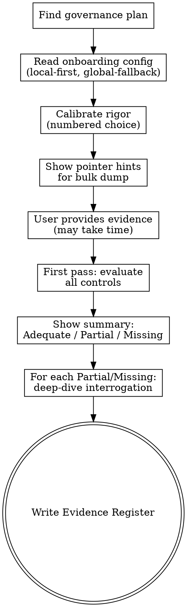

# Governance Evidence

## Overview

A governance plan recommends controls. This skill closes the loop: gather actual evidence those controls are in place, evaluate whether the evidence is good enough, and produce a structured Evidence Register tracking the gap from "recommended" to "implemented".

The skill works in two passes:

1. **Bulk gathering** — ask the user to share everything they already have, with targeted pointer hints to the tools and locations identified during onboarding. Evaluate this dump against every control in the plan to categorize each as Adequate / Partial / Missing.
2. **Per-control deep dive** — for every Partial and Missing control, interrogate the gap: what specifically is needed, where might it live, what would make this evidence sufficient.

Rigor is calibrated upfront — the user picks how skeptical Claude should be when evaluating evidence.

## Inputs

This skill requires a governance plan as input. It will look for one in this order:

1. The most recent file in `./docs/credoai/aigov_plans/` (created by `aigov-plan`)
2. A path the user provides directly
3. A plan pasted into the conversation

If none of those exist, pause and suggest running `aigov-intake` and `aigov-plan` first.

## Workflow



## Step 1 — Read context

Read the governance plan and onboarding config. Use **local-first, global-fallback precedence**:

```bash
# governance plan
ls -t ./docs/credoai/aigov_plans/*.md 2>/dev/null | head -1

# posture (drives default rigor calibration)
cat ./docs/credoai/posture.md 2>/dev/null || cat ~/.claude/credoai/posture.md 2>/dev/null

# tools (drives pointer hints + interaction protocol)
cat ./docs/credoai/tools.md 2>/dev/null || cat ~/.claude/credoai/tools.md 2>/dev/null
```

If posture is missing, ask the user the rigor question (Step 2) explicitly — don't default. If tools is missing, skip pointer hints (Step 3) and use generic prompts instead — but tell the user the bulk-dump phase will be more effective if they run `aigov-onboarding` first to record their tools.

## Step 2 — Calibrate rigor

Default the rigor level based on posture:

| Posture       | Default rigor   |
| ------------- | --------------- |
| Conservative  | Audit-ready (3) |
| Balanced      | Standard (2)    |
| Speed-focused | Lenient (1)     |
| (no posture)  | Standard (2)    |

Confirm the default — or let the user pick — using `AskUserQuestion`:

> "How rigorous should I be when evaluating your evidence?
>
> 1. **Lenient** — I'll accept good-faith efforts and document gaps without pushing back hard
> 2. **Standard** — I'll flag weak evidence and ask clarifying questions
> 3. **Audit-ready** — I'll challenge everything; if a regulator would reject it, so will I
>
> {{If posture suggests a default:}} Based on your {{Conservative / Balanced / Speed-focused}} posture, I'd suggest **{{default}}** — but pick what fits this assessment."

Carry the rigor level through every evaluation. The level shifts the bar:

| Sufficiency check                                         | Lenient  | Standard                               | Audit-ready                                |
| --------------------------------------------------------- | -------- | -------------------------------------- | ------------------------------------------ |
| Policy doc only ("we have a policy that says we'll do X") | Adequate | Partial — need operational evidence    | Missing — policies aren't implementation   |
| Single point-in-time test result                          | Adequate | Adequate if recent                     | Partial — needs continuous verification    |
| Evidence covers 80% of population                         | Adequate | Adequate with note                     | Partial — gap in coverage matters          |
| Vendor attestation without independent verification       | Adequate | Partial — note that this is unverified | Partial / Missing — depends on materiality |

## Step 3 — Bulk gathering with pointer hints

Frame the request, then provide tool-specific pointers:

> "Before we go control by control, give me everything you already have that might be relevant — even partial. The more context I have up front, the less I'll need to ask you to repeat or assemble later. This first pass may take me a few minutes to evaluate after you provide things; that's normal.
>
> Based on your tools and the controls in this plan, here's where to look:"

Generate **pointer hints** by mapping plan controls to tool inventory categories:

| Control type               | Likely tool category                 | Pointer phrasing                                                                                   |
| -------------------------- | ------------------------------------ | -------------------------------------------------------------------------------------------------- |
| Bias / fairness evaluation | Model experiment tracking            | "Eval metrics across demographic slices in your {{tool}} — most recent run for the model in scope" |
| Data lineage / provenance  | Data catalog                         | "Lineage view from {{tool}} for the training data used by this model"                              |
| Documentation / policies   | Documentation tools                  | "Whatever's in {{tool}} for AI policy, data governance, model cards"                               |
| Incident / change history  | Incident management + Issue tracking | "Recent incidents tagged AI/ML in {{tool}}; PRs touching the model in {{code tool}}"               |
| Vendor / third-party       | Vendor docs                          | "SOC 2 reports, DPAs, model cards from your model vendor in {{tool}}"                              |
| Monitoring / drift         | Monitoring                           | "Production dashboards in {{tool}} for the model"                                                  |
| Human review / oversight   | Issue tracking + Documentation       | "Workflow showing human review step — could be a runbook in {{tool}} or a JIRA workflow"           |

For each pointer, **adapt the request based on the interaction mode** in `tools.md`:

- **MCP / CLI / API** → "I can pull this myself if you tell me which {{project / page / dashboard}} to look at"
- **Manual paste / File upload / Screenshot** → "Please paste / upload / screenshot the relevant content when you're ready"
- **Not accessible** → "I know this lives there but you've flagged it as not accessible — describe what you have in your own words"

If `tools.md` is missing, use generic phrasing: "If you have eval metrics, paste them; if you have policies, point me at them; etc."

After showing the pointers, wait. The user will share things in batches. Acknowledge each batch briefly and keep going until they say they're done.

## Step 4 — First-pass evaluation

Once the user signals they're done with the bulk dump, do a comprehensive evaluation against every control in the plan. Tell them this may take a moment.

For each control, decide:

| Categorization | Meaning                                                                                |
| -------------- | -------------------------------------------------------------------------------------- |
| **Adequate**   | Evidence demonstrates the control is implemented; meets the bar set by the rigor level |
| **Partial**    | Some evidence exists but it's insufficient — gap is identifiable                       |
| **Missing**    | No evidence provided; gap is total                                                     |

Apply four sufficiency dimensions per piece of evidence:

1. **Sufficiency** — does it actually demonstrate the control, or is it aspirational?
2. **Recency** — does it reflect the current state? (a 2022 audit doesn't cover a model retrained last quarter)
3. **Scope** — does it cover the affected population, or just a subset?
4. **Verifiability** — is it a living artifact (dashboard, logged process) or a one-time document?

Each dimension's threshold scales with the rigor level (see table in Step 2).

Show a summary:

```
First-pass evaluation:
- Adequate: 8 controls
- Partial: 5 controls
- Missing: 3 controls

Total: 16 controls assessed against [Lenient / Standard / Audit-ready] rigor.
```

## Step 5 — Per-control deep dive (Partial and Missing only)

Walk through each Partial and Missing control one at a time. Skip Adequate — they're already done.

For each:

1. State the control name (exact catalog name from the plan).
2. State its current categorization and what's missing.
3. Ask 1–3 targeted questions to close the gap, using the interaction mode from `tools.md`.
4. Re-evaluate after the user responds — categorization may move from Missing → Partial → Adequate.

Example deep-dive flow for a Partial control:

> "**Bias evaluation across demographic slices** — currently Partial.
>
> You provided overall accuracy from the last training run, but I don't see breakdowns by the protected attributes called out in your governance plan (age, gender, race).
>
> 1. Have these breakdowns been computed but not pasted? If so, please share.
> 2. Or if they haven't been computed, do you know whether the eval pipeline supports slicing? Could be a quick add."

Example for a Missing control:

> "**Vendor SOC 2 attestation** — currently Missing.
>
> You're using {{vendor}} as a third-party model provider. Do you have their SOC 2 Type II report, or is procurement still working on it?
>
> If you don't have it, I'll note this as Missing in the register and flag it as a procurement action item — it's typical for vendor due diligence to lag the technical work."

After each control, update its categorization in the running register. If the user provides new evidence that uplifts it from Missing → Adequate, capture that.

## Step 6 — Write the Evidence Register

Save to:

```
./docs/credoai/aigov_evidence/YYYY-MM-DD-<system-name>.md
```

Slug: lowercase system name from the governance plan, spaces → hyphens, strip special chars.

Create the directory if needed.

## Output Format

```markdown
## Evidence Register: [System/Use Case Name]

**Plan reference:** [path to governance plan that drove this]
**Rigor level:** Lenient | Standard | Audit-ready
**Posture used:** [Conservative / Balanced / Speed-focused — local | global | none]
**Date:** YYYY-MM-DD

### Summary

- Adequate: N controls
- Partial: M controls
- Missing: K controls

### Per-Control Evidence

#### Adequate

##### [Exact control name]

**Evidence:**

- [Description of artifact, source, what it shows]
- [Multiple bullets if multiple artifacts contribute]

**Notes:** [Any context — e.g., "covers all production models as of Q1 2026"]

---

#### Partial

##### [Exact control name]

**Evidence provided:**

- [What was supplied]

**Gap:**

- [What's specifically missing — sufficiency, recency, scope, or verifiability]

**To close:**

- [Concrete action: "Re-run eval with demographic slicing"; "Get most recent vendor attestation"; etc.]

---

#### Missing

##### [Exact control name]

**Why it matters:** [1 sentence — pull from the plan's rationale]

**Suggested evidence to gather:**

- [Specific artifact and likely source/owner]

**Owner / next step:** [If known from conversation; otherwise leave blank]

---

### Recommended next actions

1. [Highest-priority action across all gaps — e.g., "Procurement: chase {{vendor}} SOC 2 by end of quarter"]
2. [...]
3. [...]

---

_Evidence assessed at [Lenient / Standard / Audit-ready] rigor against [governance plan reference]. Categorizations reflect LLM evaluation of the evidence provided in this conversation, not a certified audit._
```

After saving, tell the user the path and suggest:

> "Saved to `./docs/credoai/aigov_evidence/<filename>.md`.
>
> {{Summary count}} controls evaluated. The biggest gaps to close are: {{top 3 from Recommended next actions}}.
>
> When you've gathered more evidence and want to re-evaluate, run `aigov-evidence` again — I'll pick up from this register and re-assess the Partial and Missing items."

## Re-running on an existing register

If `./docs/credoai/aigov_evidence/` already has a file for this system, ask:

> "There's already an evidence register for this system from {{date}}. Want to:
>
> 1. **Continue from there** — re-evaluate Partial/Missing items, leave Adequate ones alone
> 2. **Start fresh** — wipe the prior register and reassess everything
> 3. **Just show me the existing one**"

Continuing from there: read the prior register, skip the bulk dump, and jump directly to deep-dive on Partial/Missing items.

## Common mistakes

**Skipping calibration.** "Standard" is a real choice, not a default. The user picking "Audit-ready" wants to be challenged — don't soften the assessment after the fact.

**Accepting policy docs as implementation evidence.** A policy that says "we will perform bias audits" is not evidence that bias audits happen. At Standard rigor or above, this is Partial at best.

**Conflating recency.** "We did a fairness audit in 2022" doesn't cover a model retrained in 2025. Always check the date of the artifact against the date of the system state being assessed.

**Skipping pointer hints.** Telling the user "share whatever you have" without telling them _where to look_ burns their time. Always generate hints from `tools.md` when it exists.

**Pulling when you should ask.** If `tools.md` says a tool is "Manual paste" mode, do NOT try to MCP-query it or run a CLI. Ask the user to paste, with specifics about what you need.

**Ignoring scope.** Evidence that covers a development model isn't evidence about the production model. Always ask whether the artifact applies to the system in scope.

**Forgetting to save.** The Evidence Register is the deliverable. Always write the file — even if the user wants to keep iterating.

**Treating the register as final.** Evidence registers are living documents. The Common mistakes above also describe what changes between re-runs — make sure re-runs uplift Partial/Missing items as new evidence arrives.
