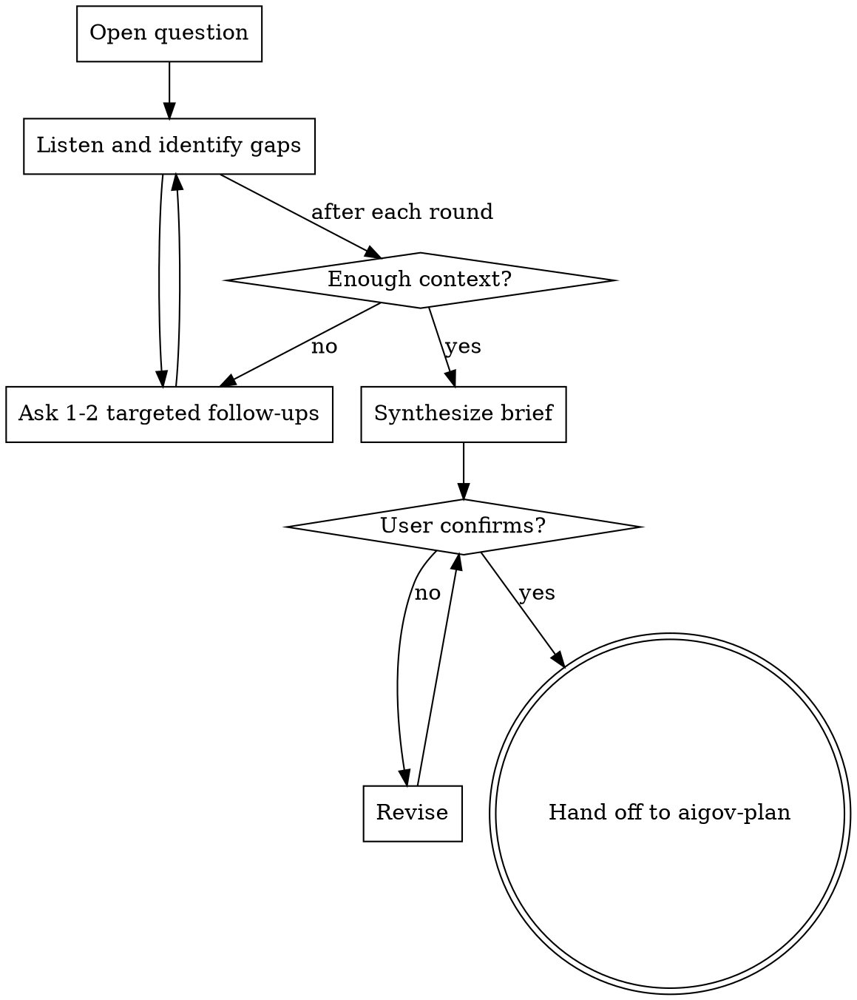

# Governance Context Intake

## Overview

Interview the user to build a Governance Context Brief. Work like a great interviewer: start open, follow the thread, probe gaps, then synthesize and confirm. The brief feeds directly into `aigov-plan`.

## Check organizational context first

Before the interview, read organizational context from onboarding using **local-first, global-fallback precedence**:

```bash
# org.md — local overrides global
cat ./docs/credoai/org.md 2>/dev/null || cat ~/.claude/credoai/org.md 2>/dev/null

# posture.md — local overrides global
cat ./docs/credoai/posture.md 2>/dev/null || cat ~/.claude/credoai/posture.md 2>/dev/null
```

If either exists at either scope, use it to:
- Skip questions already answered at the org level (e.g. if `posture.md` specifies a single jurisdiction, don't ask about jurisdiction)
- Flag relevant non-negotiables in the synthesized brief (e.g. "This system makes hiring decisions — our non-negotiable 'human review required for employment decisions' applies here")
- Reference the organization name in the brief
- Note in the brief which scope the config came from (`local` or `global`) so the audit trail is clear

If neither scope has config, proceed normally; at the end, mention that running `aigov-onboarding` would streamline future intakes.

## Flow



## The Interview

**Opening move — always start here:**

Set the frame briefly before asking. Something like:

> "I'm going to ask you about the AI system you want to govern. The goal is to make sure it's trustworthy — that it's doing what it's supposed to do, avoiding unnecessary risks, and meeting whatever policy obligations apply to it. The more I understand about it, the more useful the analysis will be.
>
> So — tell me about the AI system you want to govern. Whatever you've got, just rattle it off."

Then listen. Follow what they actually say, not a predetermined list.

**After they respond, identify gaps in these areas:**

| Area | Why it matters for scoring |
|------|---------------------------|
| What decisions the AI makes or informs | Determines harm severity |
| Whether a human reviews outputs before action | Changes likelihood dramatically |
| Who is affected — and are any vulnerable | Multiplies severity |
| Domain (healthcare, finance, HR, etc.) | Unlocks domain-specific regulations |
| Jurisdiction | Determines which laws apply |
| Deployment status (pre-launch vs live) | Shapes urgency of findings |
| How the system is built | Determines which controls are technically feasible and what vendor relationships introduce — a black-box third-party API has very different audit and remediation options than something built in-house |

**Probe style — use `AskUserQuestion` adaptively:**

Use `AskUserQuestion` whenever a gap has clear options. This is just a better UX for the same clarifying questions — the "Other" option always allows free text. Fall back to plain text only when the question is genuinely open-ended (e.g., asking someone to describe something for the first time).

- Bundle up to 4 structured questions in a single `AskUserQuestion` call when you have multiple gaps after the opening description
- Only ask about gaps that remain — skip questions already answered in the user's description
- Follow threads they open — if they mention "hiring", ask who reviews the shortlist before anyone is rejected
- Accept "I don't know" — note it as an uncertainty that affects scoring confidence

**Structured options for common gaps:**

| Gap | Question | Options |
|-----|----------|---------|
| Autonomy | "How autonomous is the system?" | Advisory (human reviews before acting) / Semi-autonomous (acts, human can override) / Fully autonomous |
| Deployment status | "Where is this system right now?" | Pre-deployment / Live in production / Under redesign |
| Domain | "What domain does this operate in?" | Healthcare / Finance / HR & hiring / Legal / Critical infrastructure / General purpose |
| Jurisdiction | "Where does this system operate?" | EU / US (federal) / US (specific states) / Global / Unknown |
| Vulnerable populations | "Does it affect any vulnerable groups?" | Yes — describe / No / Uncertain |
| Technical foundation | Ask as a plain open-ended question — see below |

**Asking about technical foundation — always use plain text, not `AskUserQuestion`:**

This one doesn't have a tidy option list. Ask conversationally, something like:

> "Walk me through how this system is actually put together — what are the main components? Are you using any third-party tools, APIs, or vendors to make it work?"

What you're listening for: what it's built on (a vendor API, an open-source model, a custom-trained model, a commercial platform), what data flows into it and where that data comes from, and any external dependencies that affect what the team can actually audit or change. "I don't know" is fine — note it, because it affects what controls are realistic.

**When you have enough:**
You can score severity meaningfully when you know: what it does, who it affects, whether humans are in the loop, what domain/jurisdiction applies, and roughly how it's built. Everything else is enrichment.

## Output: Governance Context Brief

When you have enough, synthesize and ask: *"Does this capture it? Anything off or missing?"*

```
## Governance Context Brief

**System:** [Name or short label]
**What it does:** [Core function; what decisions it makes or informs]
**Deployment status:** Pre-deployment | Live | Under redesign

**Autonomy:** Advisory (human reviews before action) | Semi-autonomous | Fully autonomous
**Affected users:** [Who, rough scale, any vulnerable populations]
**Domain:** [Healthcare / Finance / HR / Legal / Critical infrastructure / General]
**Jurisdiction:** [EU / US federal / specific states / global / unknown]

**How it's built:** [Free description — components, third-party tools or APIs, vendors, training data sources, what's in-house vs. bought]

**Data used:** [Types and sensitivity]
**Existing controls:** [Any governance or safety measures already in place]
**Specific concerns:** [What the user flagged as worrying]

**Unknowns:** [Things not established that affect scoring confidence — including technical unknowns]
```

## File output

After the user confirms the brief, save it to:

```
docs/credoai/aigov_intake/YYYY-MM-DD-<system-name>.md
```

Slug: lowercase system name, spaces → hyphens, strip special chars. Use today's date.

Create the directory if it doesn't exist. Tell the user the path.

## Handoff

Once confirmed and saved, say:

> "Good — I'll use this as the context for governance analysis. Running `aigov-plan` now."

Then invoke `aigov-plan` with the brief as context. Do not move to scoring before the user confirms the brief.
