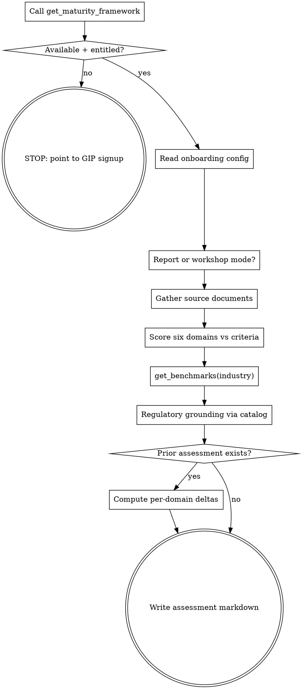

# Rapid Maturity Assessment

## Overview

A structured review of an organization's AI governance posture, scored against
the Credo AI maturity framework (five bands, six domains) from documentation
review — not self-assessment surveys. The output is an honest, evidence-grounded
baseline: where the organization stands, what is genuinely strong, where the
highest-leverage gaps are, and a 90-day path.

This assesses the **organization's governance program**. It is different from
`aigov-plan` (which plans governance for one AI system) and `aigov-audit`
(which evaluates control effectiveness for one system against gathered
evidence). A maturity assessment looks across the whole program: structures,
inventory, policy, sponsorship, controls, vendors.

## Hard gate — check FIRST, before any interview

Call `get_maturity_framework` from the Governance Hub MCP before asking the
user anything. The framework — rubric, band thresholds, scoring criteria,
methodology rules, and the required report structure — is served from the
live catalog and is the canonical substance of this assessment.

If the MCP is not configured, the call errors, or it returns
`feature_disabled` / `entitlement_required`, **STOP** and tell the user:

> A maturity assessment requires the Governance Intelligence Pro MCP — the
> Credo maturity framework, scoring rubric, and vetted industry benchmarks
> are served from the live catalog. Sign up at govportal.lab.credoai.net or
> contact engineering@credo.ai for access.

Do NOT produce a generic fallback assessment from general knowledge. A
knockoff scored against an improvised rubric dilutes the deliverable and
cannot be compared across runs. (This is intentionally stricter than
`aigov-plan`'s soft degradation.)

Record `framework.version` from the response — it goes in the report header
and enables drift detection between assessments.

## Workflow



## Step 1 — Config

Read the shared config (local-first, global fallback), as all skills in this
plugin do:

```bash
cat ./docs/credoai/org.md 2>/dev/null || cat ~/.claude/credoai/org.md 2>/dev/null
cat ./docs/credoai/tools.md 2>/dev/null || cat ~/.claude/credoai/tools.md 2>/dev/null
cat ./docs/credoai/posture.md 2>/dev/null || cat ~/.claude/credoai/posture.md 2>/dev/null
```

You need: **organization name**, **industry**, and **jurisdiction(s)**. If not
in config, ask in one compact question. Note which scope each config was
loaded from for the report header.

## Step 2 — Mode

Ask one question: standalone **report** or **workshop deliverable**?
Workshop mode adds the framework's `workshopSections` (timed agenda +
dialogue prompts) and frames the next-steps section as commitments to be
made in the room. Default to report if the user doesn't care.

## Step 3 — Gather source documents

Documentation review is the method. Scores reflect only what the materials
demonstrate.

1. Enumerate candidate sources from `tools.md`, respecting each tool's
   interaction protocol: pull via MCP/CLI/API where the protocol allows;
   otherwise ask the user to paste/upload. Typical materials: AI governance
   playbooks/policies, AI register exports, intake/review templates,
   committee charters and minutes, vendor assessment questionnaires,
   model monitoring runbooks, board reporting decks.
2. If a prior `aigov-evidence` register exists (`./docs/credoai/aigov_evidence/`),
   reuse it as evidence — it is already categorized.
3. Ask once for "everything you have" rather than trickling requests.
4. Record the **exact list of materials reviewed** (title, version/status,
   date). They are the exclusive evidentiary basis; say so in the report.

Two or three substantive documents are enough for a rapid assessment. Zero
documents → explain that there is nothing to score and offer to proceed as a
*provisional* interview-based assessment, clearly labeled as such on every
score.

## Step 4 — Score the six domains

For each domain in `framework.domains`, walk its four `criteria` in ladder
order (exists → documented → operational → improving) and record, per
criterion, the **specific evidentiary observation** that satisfies or fails
it (document name + what it shows). Then assign the domain score (1.0–5.0,
one decimal) applying `framework.scoringRules` strictly:

- **Operation, not design.** A sophisticated framework marked DRAFT with no
  activation evidence scores like the framework does not exist — capture its
  quality under Strengths instead.
- A domain needs affirmative evidence of **all four criteria** to score
  above 3.0.
- Overall score = arithmetic mean of the six domain scores, one decimal.
- Map scores to bands using `framework.bands` ranges; use exact band names.

Calibration: most organizations 12–24 months into active governance work
land between 2.0 and 2.8. Wide in-document variance is normal; flattening
everything to one number per domain without rationale is the failure mode.

## Step 5 — Benchmarks

Call `get_benchmarks({ industry })`. Follow the response `guidance` exactly:

- Claims returned → use ONLY those claims, each rendered with its source
  attribution and date. Map claims to domains via `domainId` where present.
- Empty + omit guidance → **omit the benchmarks section entirely.** Never
  invent, estimate, or recall benchmark statistics from memory. An
  assessment with no benchmarks section is credible; one with invented
  numbers is poison.

## Step 6 — Regulatory grounding

Query the catalog for the frameworks that actually apply:

1. `governance_query` with the org's industry + jurisdiction (e.g.
   "AI governance obligations for insurers operating in New York"),
   requesting policies and policy_requirements.
2. `get_entities` on the top matches to get full canonical text.
3. Select the 2–4 most applicable frameworks; for each, write a
   why-it-matters-for-this-org paragraph grounded in what the documents
   showed (e.g. a self-identified gap that maps to a specific obligation).

Use exact catalog names — never paraphrase regulation titles.

## Step 7 — Write the assessment

Output to `./docs/credoai/aigov_maturity/YYYY-MM-DD-<org-slug>.md`
(lowercase, spaces→hyphens). Follow `framework.reportStructure` — every
section, in order, honoring each section's description — plus
`workshopSections` in workshop mode. The header block must record:

```markdown
- Organization: <name> · Industry: <industry> · Jurisdiction: <jurisdictions>
- Assessment date: <YYYY-MM-DD>
- Framework version: <framework.version>
- Mode: report | workshop
- Config scope: local | global (per file)
- Source materials: <numbered list with version/status/date>
- Benchmarks segment served: <segmentServed | omitted>
```

Scores table early, rationale deep: the maturity profile section carries the
full per-domain evidentiary reasoning — criterion by criterion, citing
documents.

## Re-runs — trend over time

If prior assessments exist in `./docs/credoai/aigov_maturity/`, read the most
recent one and add a **Trend** subsection to the maturity profile: per-domain
delta table (previous → current, with the one-line reason for each move) and
overall trajectory. If the prior assessment's framework version differs,
note it and flag any domains whose criteria changed (framework drift) — a
score move under a changed rubric is not a like-for-like trend.

## After the assessment

Suggest next steps without auto-running them:

- `aigov-maturity-viz` — render the workshop-grade HTML deliverable
- `aigov-evidence` → `aigov-audit` — for the system-level deep dive on
  domains that scored low
- `/share` — publish the rendered deliverable to the Governance Hub

## Common mistakes

**Scoring intent.** "The playbook mandates quarterly board reporting" is
design. Minutes from the last two quarters are operation. Score the latter.

**Proceeding without the gate check.** The framework call is first — before
config, before questions. The rubric must come from the MCP, not memory.

**Invented benchmarks.** Only `get_benchmarks` claims, verbatim sourced.
Empty response → no benchmarks section. No exceptions.

**Paraphrased regulation names.** Exact catalog names from
`governance_query`/`get_entities` only.

**Scoring above 3.0 on three criteria.** All four, evidenced, or the domain
caps at 3.0.

**Treating a populated framework as a populated register.** A register
*schema* with required fields defined is criterion 2; rows in it with review
timestamps is criterion 3.

**Flattering the score.** The assessment's value is calibration. "2.5 and
here is exactly why, and exactly what 3.5 looks like" serves the user;
rounding up to 3.2 to be nice does not.
