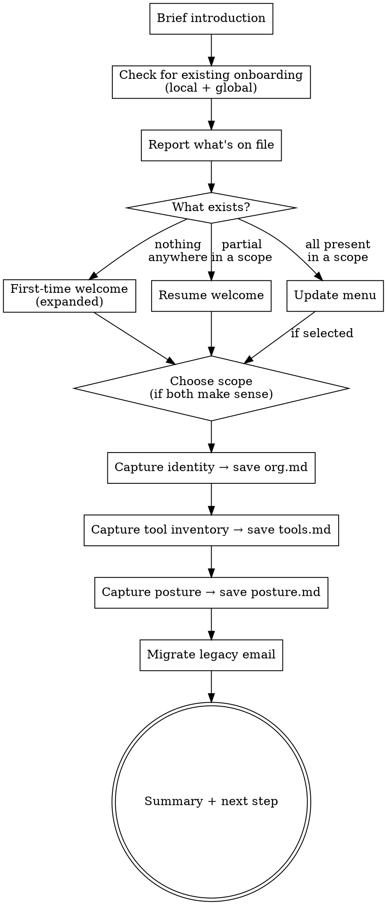

# Governance Onboarding

## Overview

Capture once, reuse everywhere. This skill establishes persistent governance context for the governance-intelligence-pro pipeline — so every downstream skill (intake, plan, plan-viz, evidence, audit, audit-viz, share) can skip questions the user has already answered and tailor its output to the user's actual tools and principles.

The captured config lives in two possible scopes:

| Scope      | Location                                    | Use for                                                                                                                                                                                                                |
| ---------- | ------------------------------------------- | ---------------------------------------------------------------------------------------------------------------------------------------------------------------------------------------------------------------------- |
| **Global** | `~/.claude/credoai/`                        | Defaults that apply across every directory you work in — your org, your usual tools, your baseline posture                                                                                                             |
| **Local**  | `<current working directory>/docs/credoai/` | Overrides for the current working directory — useful when work in this folder has different posture, tools, or identity than your defaults. The folder doesn't need to be a git repo or any specific project structure |

Files (in either scope):

- `org.md` — organization name and user role
- `tools.md` — what systems hold governance evidence, and how Claude interacts with each
- `posture.md` — regulatory baseline, risk appetite, non-negotiables

Always global only:

- `email.md` — governance hub publishing email (tied to a person, not a directory; migrated from `~/.claude/governance-hub-email.md` if present)

**Lookup precedence:** every downstream skill checks **local first**, then falls back to **global**. Mix-and-match works — a directory can override `posture.md` only and still inherit global `tools.md`.

**Resumable.** Each section writes its file as soon as it's captured. If the user stops mid-onboarding and re-runs later, the skill detects what's already done and resumes only the missing sections.

## When to run

- **Explicitly** — user runs `aigov-onboarding` directly
- **Implicitly** — other governance skills check for `posture.md` (local then global); if missing, pause and suggest running onboarding first
- **Resume** — any re-run automatically detects prior progress and continues
- **Update** — if all files exist, offers a menu to review and change sections
- **Local override** — when global config exists and the user wants overrides for a specific directory

## Flow



## Step 0 — Brief introduction

Always lead with a short, friendly identification of the skill — two or three sentences, no more. The point is to orient the user before doing anything else, including before scanning their filesystem. Use plain prose, not the full-blown welcome (that comes later, only if the user is genuinely new).

> "Hi — I'm `aigov-onboarding`. I capture your organization's governance context (identity, tool inventory, governance posture) once so every other governance skill can reuse it without re-asking. Let me check whether you've already done some of this so we can pick up where you left off."

Then proceed immediately to Step 1 — don't wait for acknowledgment here. The intro is informational, not a gate.

## Step 1 — Check for existing onboarding

Scan **both** locations:

```bash
ls -la docs/credoai/ 2>/dev/null
ls -la ~/.claude/credoai/ 2>/dev/null
```

For each of `org.md`, `tools.md`, `posture.md`, note whether it exists in:

- **Local** scope (`<current working directory>/docs/credoai/`)
- **Global** scope (`~/.claude/credoai/`)

Read the contents of any that do — they're useful context for the summary and prevent re-asking.

Also check for legacy `~/.claude/governance-hub-email.md` — the email migration step runs independently of the main flow.

**Capture the CWD** — `pwd` — and use it when showing the user where local config would live. Don't try to detect "is this a real project?" (e.g. via git or a `package.json` check). The user knows whether the current directory is meaningful — they might be working in a git repo, a folder of governance docs, a network drive, or anywhere else. Just show the actual path and let them decide.

After the scan, **briefly tell the user what you found** — one line, conversational. Examples:

- Nothing found anywhere: "I don't see any prior onboarding. Let me walk you through it."
- Global only: "Found global config in `~/.claude/credoai/` with identity, tools, and posture. Looks complete."
- Partial in global: "Found partial global onboarding — identity and tools, but no posture yet."
- Local exists in this directory: "This directory has its own governance config in `./docs/credoai/`."
- Both exist: "Found both global config (`~/.claude/credoai/`) and local config (`./docs/credoai/`)."

Then branch — show the full **First-time welcome** if nothing exists; show the **Resume welcome** if partial; show the **Update menu** if all three files exist in a scope.

## Step 2 — Choose scope

Always offer the choice. Tailor based on existing state:

**Case A — nothing captured anywhere:**

> "Where should I save this onboarding?
>
> 1. **Global** (`~/.claude/credoai/`) — applies everywhere you use the governance skills, regardless of which directory you're in. Recommended for most cases.
> 2. **Local to this directory** (`<CWD>/docs/credoai/`) — saves alongside whatever you're working on here. Useful if this work has a different posture or different tools than your usual defaults.
>
> If you're not sure, pick global — you can always re-run onboarding later in a specific directory to add overrides."

**Case B — global config exists, no local config in this directory:**

> "I see you've already onboarded globally — your defaults are in `~/.claude/credoai/`. For this directory (`<CWD>`), what would you like?
>
> 1. **Inherit global** — use the global config as-is (no changes needed; exit)
> 2. **Add local overrides** — keep global as the baseline, but capture different posture / tools / identity for this directory (saved to `<CWD>/docs/credoai/`)
> 3. **Update global config** — your global defaults need a refresh"

**Case C — local config exists in this directory:**

> "This directory has its own governance config in `<CWD>/docs/credoai/`. What would you like?
>
> 1. Update this directory's config
> 2. Update global config (`~/.claude/credoai/`)
> 3. Exit"

Use `AskUserQuestion` for each. Carry the chosen scope through the rest of the flow — every file write goes to the chosen scope's directory. Show real paths (not placeholders) when you ask.

## First-time welcome

Show this only when the Step 1 scan finds **nothing in either scope**. The brief intro at Step 0 has already identified the skill, so this welcome can skip the "hi, I'm aigov-onboarding" framing and go deeper on context — what the broader pipeline does, what to expect from this session.

> # Welcome to Credo AI's Governance Intelligence Pro
>
> Since we're starting fresh, here's the bigger picture. You're setting up a governance toolkit designed to help you build AI systems people can actually trust. Seven skills work together as a pipeline — each one builds on the last:
>
> 1. **`aigov-intake`** — a focused interview about a specific AI system to capture the context (purpose, users, data, deployment) downstream skills need
> 2. **`aigov-plan`** — turns that context into a risk-scored plan with prioritized controls and compliance obligations
> 3. **`aigov-plan-viz`** — renders the plan as an interactive HTML dashboard (executive overview, risk view, compliance view, action view)
> 4. **`aigov-evidence`** — gathers proof that the recommended controls are actually in place, producing an Adequate / Partial / Missing register
> 5. **`aigov-audit`** — a formal assessment that evaluates control effectiveness, residual risk, and compliance posture against the canonical catalog
> 6. **`aigov-audit-viz`** — renders the audit as an HTML dashboard for executives, regulators, or board reviews (initial vs. residual risk, compliance scoreboard, drift callouts)
> 7. **`aigov-share`** — the final showcase step: publish either your plan or your audit dashboard to the Credo AI Governance Hub so stakeholders can view it via a shareable link
>
> All of them are backed by **Credo AI Governance Intelligence** — a living catalog of AI risks, mitigation controls, and policy requirements curated by our governance team and grounded in regulations like the EU AI Act, NIST AI RMF, ISO 42001, and industry standards. Instead of reinventing governance for every system you ship, you map to an expert-maintained taxonomy and get context-specific risk scoring, prioritized controls, and actionable compliance obligations for _your_ deployment.
>
> ---
>
> **What we'll do now (about 5 minutes):**
>
> 1. Decide whether to save this setup globally or only in the current directory
> 2. Get your name and organization
> 3. Map out the tools where your governance information lives — and how you'd like me to interact with each
> 4. Capture your governance posture — which regulations apply, your risk appetite, and any non-negotiables
>
> Everything gets saved to a `credoai/` directory and every downstream skill reads from there, so you won't have to re-answer any of it.
>
> **If you need to step away at any point**, just end the conversation — I save each section as soon as we finish it, so when you come back and run `aigov-onboarding` again we'll pick up exactly where you left off.
>
> Ready to start?

Wait for a positive acknowledgment ("yes", "go", "ready", a thumbs up, etc.) before proceeding. If the user wants to skip the tour and dive in, accept that.

## Resume welcome (partial existing config in chosen scope)

When some files exist in the chosen scope but not all:

> # Welcome back
>
> Looks like you've already completed part of onboarding (in **{{scope}}** scope):
>
> {{bulleted list of completed sections, each with a 1-line summary from the existing file — e.g.:}}
>
> - ✓ Identity — {{Organization Name}} ({{User role}})
> - ✓ Tool inventory — {{N}} tools listed
>
> Still to go:
>
> {{bulleted list of missing sections}}
>
> - Governance posture (regulations, risk appetite, non-negotiables)
>
> This should only take a minute or two. If you'd rather review and change what's already captured, say "review" instead — otherwise I'll just do the missing sections.

Accept "review" as a jump into the Update menu. Otherwise, proceed with the missing sections only.

## Step 3 — Identity

Skip if `org.md` already exists in the chosen scope and not in Update flow.

- **Organization name** (free text) — used in reports and dashboards
- **Your role** (`AskUserQuestion`) — AI/ML engineer, Data scientist, Governance/risk officer, Compliance, Legal, Product, Executive, Other

**Immediately after capture, write `org.md`** to the chosen scope's directory before moving on. This preserves progress if the user quits.

## Step 4 — Tool inventory and interaction protocol

Skip if `tools.md` already exists in the chosen scope and not in Update flow.

Frame it — emphasize this is about **how you and Claude will work together**, not a capability checklist:

> "Next I want to know where governance-relevant information lives in your org — and, just as important, **how we'll work together on each tool**. Some things I can pull automatically (via MCP or a CLI you have installed). Others you'll need to paste or upload when I ask. There's no right answer — the point is to agree on a protocol so later skills know whether to pull the data themselves or ask you to provide it."

Walk through categories one at a time with `AskUserQuestion` (don't bundle — options differ):

| Category                  | Common tools                                  |
| ------------------------- | --------------------------------------------- |
| Model experiment tracking | Weights & Biases, MLflow, Neptune, SageMaker  |
| Data catalog / lineage    | Atlan, DataHub, Collibra, Custom, Spreadsheet |
| Documentation / policies  | Confluence, Notion, SharePoint, Google Drive  |
| Issue tracking            | Jira, Linear, GitHub Issues, Asana            |
| Code / PRs                | GitHub, GitLab, Bitbucket                     |
| Incident management       | PagerDuty, Opsgenie, Jira                     |
| Vendor / contract docs    | SharePoint, Google Drive, DocuSign            |
| Monitoring / dashboards   | Grafana, Datadog, New Relic, Custom           |

Each category accepts "None / we don't use any of these" as a valid answer.

**For every tool the user names, ask one follow-up** with `AskUserQuestion` — **"How should I interact with [tool] when I need info from it?"**:

1. **MCP connection** — I can query it automatically (connected MCP server)
2. **CLI** — you have a command-line tool installed and I can run it via Bash (`gh`, `wandb`, `jira`, etc.)
3. **API with credentials** — you'll provide an API token / URL, I'll make HTTP calls directly
4. **Manual paste** — you'll copy/paste the relevant content when I ask
5. **File upload** — you'll export and upload files when needed
6. **Screenshot** — you'll share a screenshot for anything visual
7. **Not accessible** — info lives here but there's no way to get it to me; note it anyway

Accept combinations — e.g. "MCP for queries, file upload for full exports". Capture the primary mode and any secondary note.

If the user picks **CLI**, ask one follow-up: the CLI command name, so Claude can `which <cmd>` later. For **API**, note that credentials should be supplied at use time (not stored in config). For **not accessible**, still record the tool so downstream skills know the info _exists_ but can't be fetched.

**Immediately after capture, write `tools.md`** to the chosen scope's directory before moving on.

## Step 5 — Governance posture

Skip if `posture.md` already exists in the chosen scope and not in Update flow.

Frame it:

> "Now I'll capture your governance posture for {{global / this directory}}. This shapes how aggressive scoring and recommendations are across every system you assess at this scope."

**Regulatory baseline** — `AskUserQuestion` with options: EU AI Act, NIST AI RMF, ISO 42001, ISO 27001, SOC 2, HIPAA, GDPR, FDA (SaMD), Financial services (FFIEC/OCC), Internal only, Other. Accept multiple by asking "anything else?" after each selection until user says no.

**Risk appetite** — `AskUserQuestion` with numbered choices:

1. **Conservative** — we prioritize trust; any customer-facing AI is high-risk until proven otherwise
2. **Balanced** — we weigh risk against velocity case-by-case
3. **Speed-focused** — we move fast on internal tools, careful on external

**Non-negotiables** — free text:

> "List any hard constraints that apply regardless of system. Examples: 'Human review required for any employment/credit/healthcare decision', 'No customer data used for training without explicit opt-in'. Leave blank if none."

**Immediately after capture, write `posture.md`** to the chosen scope's directory before moving on.

## Step 6 — Legacy email migration

Email always lives globally — runs independently of scope choice.

Check `~/.claude/governance-hub-email.md`. If it exists:

1. Read its contents
2. Write `~/.claude/credoai/email.md` with the same content
3. Delete the old file
4. Tell the user it was migrated

If neither exists, do NOT ask for email here — `aigov-share` prompts on first publish.

## File formats

**`org.md`:**

```markdown
---
updated: YYYY-MM-DD
scope: global | local
---

**Organization:** {{name}}
**User role:** {{role}}
```

**`tools.md`:**

```markdown
---
updated: YYYY-MM-DD
scope: global | local
---

| Tool     | Category     | Interaction mode                                                           | Details                                                             |
| -------- | ------------ | -------------------------------------------------------------------------- | ------------------------------------------------------------------- |
| {{tool}} | {{category}} | MCP / CLI / API / Manual paste / File upload / Screenshot / Not accessible | {{CLI command, API notes, or "user will paste X when asked", etc.}} |
```

The **Interaction mode** tells every downstream skill how to request info:

- **MCP / CLI / API** → Claude attempts the fetch itself; asks the user only on failure
- **Manual paste / File upload / Screenshot** → Claude phrases a direct request ("Please paste your latest W&B eval metrics") with enough specificity that the user knows exactly what to provide
- **Not accessible** → Claude notes in output that this source exists but couldn't be verified

**`posture.md`:**

```markdown
---
updated: YYYY-MM-DD
scope: global | local
---

## Regulatory baseline

- {{regulation}}

## Risk appetite

**{{Conservative / Balanced / Speed-focused}}** — {{description}}

## Non-negotiables

- {{constraint}}
```

The `scope:` field in the frontmatter records where the file lives — useful when multiple files are merged at read time.

## Summary + next step

After all relevant sections are captured, summarize the final state, including which scope was used and what's inherited from the other scope (if applicable):

> "Onboarding complete. {{scope}} config saved to `{{path}}`:
>
> - `org.md` — {{org name}}, {{user role}}
> - `tools.md` — {{N}} tools listed (mix of interaction modes)
> - `posture.md` — {{regulatory summary}}, {{risk appetite}}
>
> {{If local scope and global config also exists:}}
> Inherited from global where this directory doesn't override: {{list of inherited files}}.
>
> Next step: run `aigov-intake` to assess your first system."

## Update flow (all files present in chosen scope)

If all three files exist in the chosen scope at Step 0, skip the welcome and offer numbered choices:

1. Review and update identity (`org.md`)
2. Review and update tool inventory (`tools.md`)
3. Review and update posture (`posture.md`)
4. All of the above
5. Exit — no changes

Show the current values first for any section the user selects, then ask what to change. Rewrite the file with an updated `updated:` date.

## How downstream skills use this config

Every governance skill reads with **local-first, global-fallback precedence**:

```bash
# pseudocode
read_config(name) {
  if exists(./docs/credoai/$name) return ./docs/credoai/$name
  if exists(~/.claude/credoai/$name) return ~/.claude/credoai/$name
  return null
}
```

If neither exists, the skill continues without the config (don't block on onboarding being run).

| Skill            | Reads                             | Uses for                                                                                                  |
| ---------------- | --------------------------------- | --------------------------------------------------------------------------------------------------------- |
| `aigov-intake`   | `org.md`, `posture.md`            | Skip jurisdiction/domain questions if posture already specifies; apply non-negotiables as default context |
| `aigov-plan`     | `posture.md`                      | Bias risk scoring toward risk appetite; inject non-negotiables into rationale                             |
| `aigov-plan-viz` | `org.md`                          | Organization name in footer                                                                               |
| `aigov-share`    | `~/.claude/credoai/email.md` only | Publishing email (always global, never local)                                                             |
| `aigov-evidence` | `tools.md`, `posture.md`          | Phrase evidence requests per tool's interaction mode; calibrate rigor against risk appetite               |

When a skill reads config, it should mention which scope it pulled from in its output (e.g., a small note in the rationale: "scored using local posture (`./docs/credoai/posture.md`)") — that traceability matters for audits and for users who forgot they had local overrides.

## Common mistakes

**Skipping the welcome on a first-time run.** The welcome sets expectations and explains the value. Don't compress it away because the user seems eager — they'll benefit from the framing.

**Starting from scratch when some config exists.** Always run Step 0 detection across BOTH scopes. If the user onboarded last week and comes back today, they should NOT redo identity and tools just to update their posture. If they have global config and they're running in a new directory for the first time, ASK whether they want to inherit, override, or update global — don't silently start over.

**Writing all files at the end.** Each capture step must write its file immediately — that's what makes the flow resumable. If you batch writes, a mid-flow quit loses everything.

**Saving email locally.** Email is always global — it's tied to a person's Governance Hub account, not a directory. Even when the user picks "local" scope for everything else, email goes to `~/.claude/credoai/email.md`.

**Forgetting precedence in downstream skills.** Local overrides global. Always check local first. A skill that only reads `~/.claude/credoai/` will silently ignore local overrides.

**Trying to detect "is this a project?".** Don't. Don't run `git rev-parse`, don't check for `package.json`, etc. The user's working directory is whatever they've decided to work in — could be a git repo, a folder of governance docs, a network drive, anywhere. Always offer the local scope option and show the actual CWD path; let the user decide whether saving here makes sense.

**Over-asking.** If the user already mentioned something in the opening turn (e.g. "I'm a compliance officer at Acme"), don't re-ask. Capture what they said and only ask for what's missing.

**Bundling MCP question with tool selection.** Ask the category first ("which experiment tracker do you use?"), then ask interaction mode separately. Keep each `AskUserQuestion` focused on one decision.

**Inventing tools.** If the user says "none" for a category, write it as "None" in `tools.md`. Don't leave the row out — explicit "None" tells downstream skills not to suggest evidence there.

**Skipping the summary.** The final confirmation is what makes the stored config feel intentional. Always show what was captured, where it lives, and what's being inherited from another scope.
