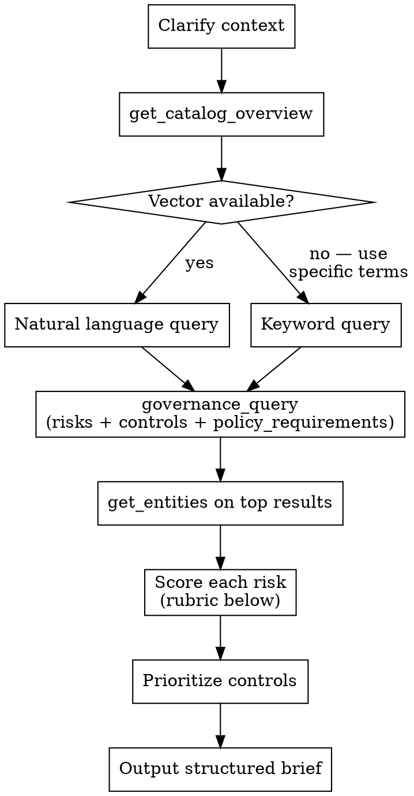

# Governance Plan

## Overview

Fetch governance data from the Governance Hub MCP, then apply LLM reasoning to score risks and prioritize controls for the specific deployment context described. The catalog returns semantically matched risks, controls, and policy requirements — this skill adds the judgment layer: how bad is each risk _here_, and which controls to tackle first.

**MCP connection:** This project's Claude Code session connects to the Governance Hub MCP (staging). Confirm with `get_catalog_overview` before querying.

## Check organizational posture first

Before scoring, read posture using **local-first, global-fallback precedence**:

```bash
cat ./docs/credoai/posture.md 2>/dev/null || cat ~/.claude/credoai/posture.md 2>/dev/null
```

If posture exists at either scope, use it to:

- **Bias scoring toward risk appetite** — Conservative posture pushes borderline scores up a tier (e.g. medium → high); Speed-focused posture pushes borderline scores down only when the rationale is strong; Balanced is neutral
- **Apply non-negotiables as forced constraints** — if a non-negotiable is violated by the described system, that risk is Critical regardless of severity/likelihood product
- **Prioritize regulatory baseline controls first** — controls tied to the org's declared regulations go in "Do now" even if not strictly mandatory for this specific system

Always note in the rationale when posture shaped a score, including which scope the posture came from (e.g. "raised to High per local conservative posture" or "flagged Critical due to global non-negotiable: human review required for employment decisions"). If posture is absent at both scopes, score without these adjustments.

## Workflow



## Context to Gather First

Before querying, establish (ask if not provided):

- **What does the system do?** (classifier, recommender, generative, agentic, optimization)
- **Who are the affected users?** (employees, customers, vulnerable populations, general public)
- **What domain?** (healthcare, finance, HR, critical infrastructure, general)
- **Regulatory jurisdiction?** (EU, US federal, US state, specific country)

More context = more accurate scores. Generic descriptions produce generic scores.

## Scoring Rubric

### Risk: Severity (1–5)

Impact if this risk materializes _in this specific context_:

| Score | Meaning                                                                     |
| ----- | --------------------------------------------------------------------------- |
| 5     | Irreversible harm, broad population affected, criminal/regulatory liability |
| 4     | Significant harm, legal exposure, difficult to reverse                      |
| 3     | Moderate harm, reputational risk, correctable with effort                   |
| 2     | Minor harm, easily corrected                                                |
| 1     | Theoretical in this context; minimal real-world impact                      |

### Risk: Likelihood (1–5)

Probability given the specific deployment context:

| Score | Meaning                                   |
| ----- | ----------------------------------------- |
| 5     | Highly probable in normal operation       |
| 4     | Likely under common conditions            |
| 3     | Possible; requires specific circumstances |
| 2     | Unlikely but plausible                    |
| 1     | Very unlikely given this context          |

### Priority Tier (Severity × Likelihood)

| Range | Tier         | Action                      |
| ----- | ------------ | --------------------------- |
| 20–25 | **Critical** | Address before deployment   |
| 12–19 | **High**     | Address within first sprint |
| 6–11  | **Medium**   | Address within 90 days      |
| 1–5   | **Low**      | Monitor; revisit quarterly  |

### Control Prioritization Order

1. **Mandatory** — has linked `policy_requirement_ids` (legal obligations, non-negotiable)
2. **High-leverage** — high `mitigated_risk_count` (addresses many risks at once)
3. **Preventive before Detective before Corrective** (earlier in lifecycle = lower cost)
4. **Quick wins** — `has_implementation_guidance: true` + narrow scope

## File output

Save the governance brief to:

```
docs/credoai/aigov_plans/YYYY-MM-DD-<system-name>.md
```

Slug: lowercase system name, spaces → hyphens, strip special chars. Use today's date.

Create the directory if it doesn't exist.

**Stamp the plan's frontmatter** so the registry and downstream skills can
resolve it by identity. Carry the `system_id` forward from the intake brief's
frontmatter (if the brief has none — e.g. plan run standalone — read the
`system_id` for this system from `./docs/credoai/registry.md`, or mint
`sys_<slug>_<6-hex>` and add the roster row, matching `aigov-intake`). Write at
the top of the plan file:

```markdown
---
system_id: sys_<slug>_<hex>
system_name: <Name>
artifact_type: plan
date: <YYYY-MM-DD>
---
```

## Conversation output

After saving, **do not print the full brief to the conversation.** Keep the chat response short:

1. State the file path that was written.
2. One or two sentences of high-level framing — overall risk posture (e.g. "two Critical risks, mostly High otherwise"), or the headline obligation, or the dominant theme. No tables, no per-risk breakdowns, no control lists.
3. Ask the user to review the file and confirm it looks right.

Example:

> Wrote the governance plan to `docs/credoai/aigov_plans/2026-04-25-hireassist.md`. Overall posture is High — two Critical risks (disparate impact, lack of human review) drive the priority list, with EU AI Act high-risk obligations as the binding constraint. Please look it over and make sure it seems correct.

The full structured brief lives in the file. The conversation is for orientation, not duplication.

## Brief Format (file content)

The saved file should follow this structure:

```
## Governance Brief: [System/Use Case Name]

### Context
[1–2 sentences confirming what is being assessed and the deployment context]

### Risk Assessment

| Risk | Type | Severity | Likelihood | Score | Tier | Context-Specific Rationale |
|------|------|----------|------------|-------|------|---------------------------|
| ... | ... | .../5 | .../5 | ... | ... | Why this score here, not generically |

Show Critical + High tiers in full. Summarize Medium/Low as a count.

### Control Roadmap

**Do now — Mandatory (legal obligations):**
- [Control label] — satisfies [policy requirement(s)]; mitigates: [Risk A], [Risk B]

**Do next — High-leverage:**
- [Control label] — mitigates: [Risk A], [Risk B], [Risk C]

**Quick wins:**
- [Control label] — mitigates: [Risk A]; [why it's quick]

### Key Compliance Obligations
- [Actionable "you must..." statements drawn from policy_requirements]

### Governance Gaps
[Risks in Critical/High tier with no associated controls in the catalog]

---
*Scores reflect LLM judgment applied to the described context, not a certified risk assessment.*
```

## Taxonomy Fidelity + Contextualization

This is the core value of the governance plan. The catalog provides structure — which risk scenarios exist, which controls address them, which policy requirements apply. Your job is to make that structure _mean something_ for this specific system.

**Use exact catalog names, then contextualize:**

For every risk, use the exact risk scenario phrase returned by `get_entities` — don't paraphrase or invent a summary. Then add a context sentence explaining how that scenario specifically manifests here.

```
Risk: [Exact catalog risk scenario name]
In HireAssist, this means: [concrete description of how it shows up — what data, what users, what mechanism]
```

For every control, use the exact mitigation category name from the catalog. Then describe what that category concretely looks like for this system — given its model type, training approach, and deployment context.

```
Control: [Exact catalog mitigation category name]
For HireAssist, this means: [specific action — e.g., "run SHAP on the resume scorer to surface top contributing features per candidate, logged for recruiter review"]
```

**Let the technical foundation shape feasibility.** A vendor black-box model can't implement SHAP explainability — the control becomes "request explanation documentation from the vendor." A fine-tuned LLM has different data lineage obligations than a scoring model trained on structured HR data. A fully autonomous system needs different oversight controls than an advisory one. These distinctions must show up in the contextual descriptions.

**The catalog relationships are load-bearing.** The mapping of which controls address which risks comes from `policy_requirement_ids` and `mitigated_risk_count` in the catalog — trust those relationships. The contextual rationale explains _why_ a given control addresses a given risk _here_, not whether the relationship exists.

## Common Mistakes

**Using catalog match scores as severity scores.** The MCP returns semantic relevance scores (1.0 = best match to query). These are not risk ratings. Always apply the rubric independently.

**Skipping `get_entities`.** `governance_query` returns truncated descriptions. Fetch full records for the top 8–10 risks before scoring — truncated context produces wrong scores.

**Paraphrasing catalog names.** Use the exact risk scenario and mitigation category names. Paraphrasing disconnects the output from the taxonomy and makes it harder to trace back to the catalog.

**Scoring risks generically.** "Disparate model performance" is severity 3 for a playlist recommender, severity 5 for a hiring screen. The rubric only works when applied to the specific context, not in the abstract.

**Ignoring the technical foundation.** A control that requires access to model internals isn't feasible for a vendor black-box. The model type, training approach, and data types from the intake brief must shape which controls are described as implementable.

**Presenting scores as ground truth.** Always include the disclaimer that scores reflect LLM judgment on the described context.
